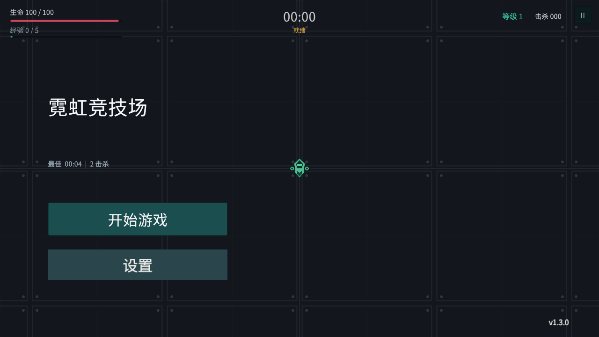
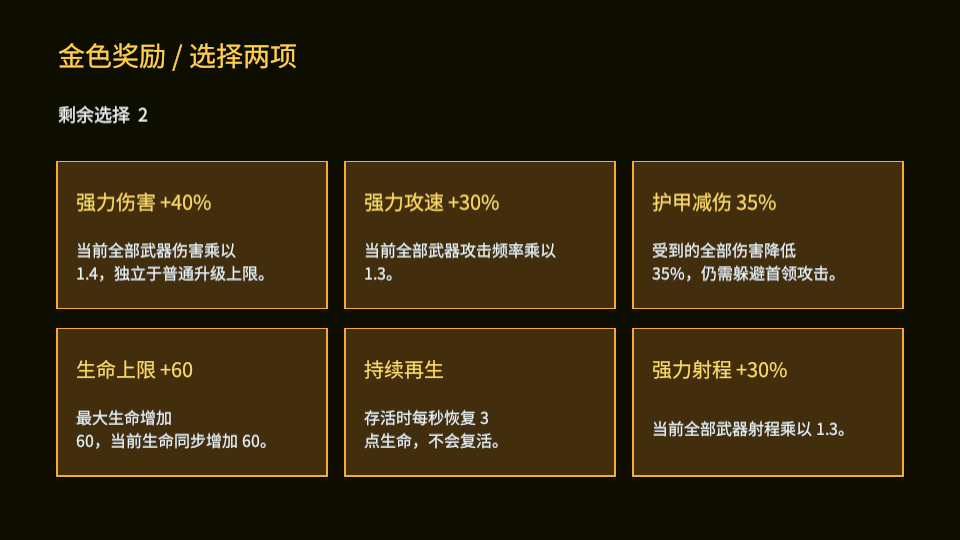
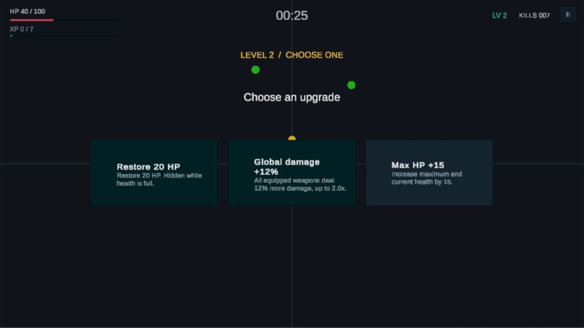
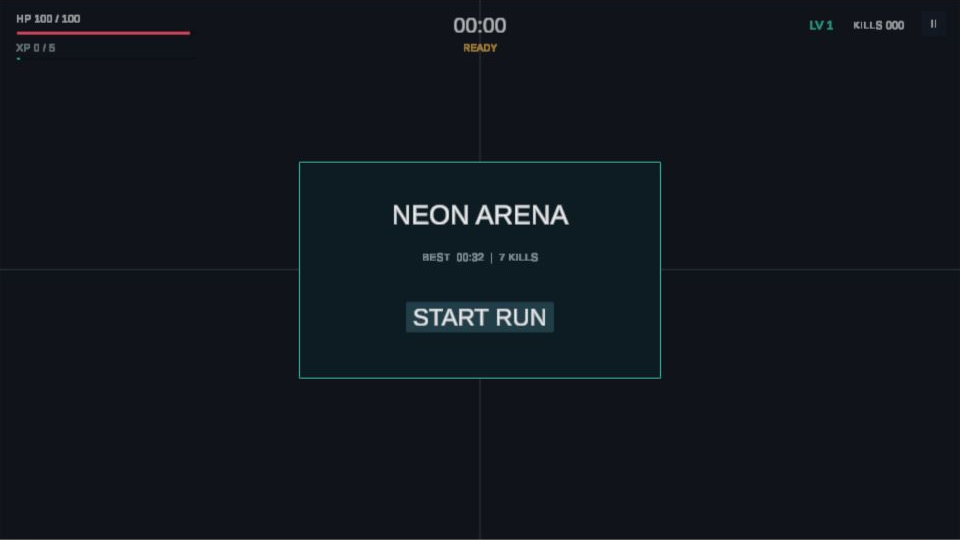
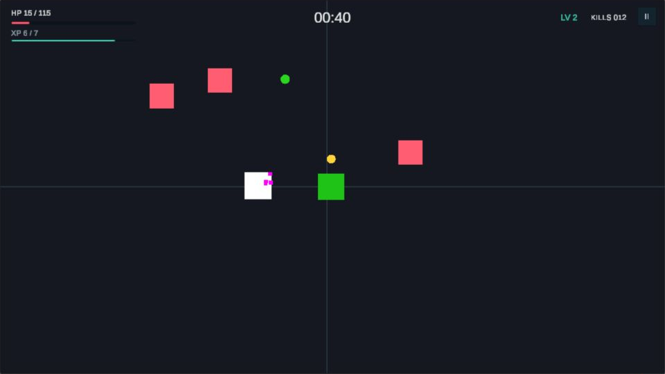
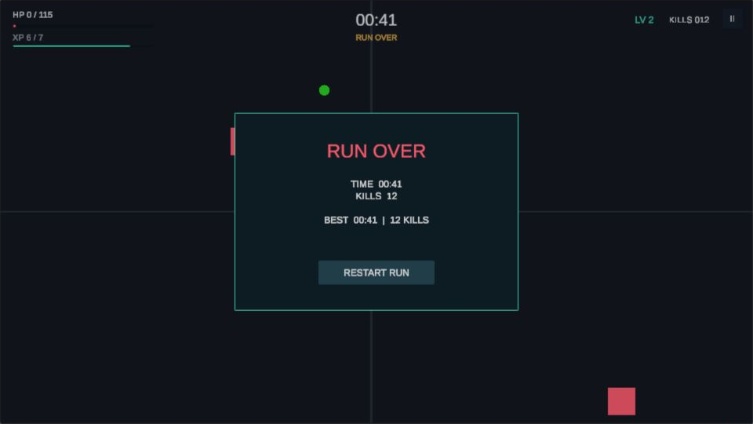

# Neon Arena Rebuild

使用 Unity 6 与 C# 跟随教程重写并在 AI 辅助下迭代的 2D 生存射击项目。玩家开局从三种武器中选择一把，在有限竞技场中移动并自动射击，击败敌人获得经验，再通过三选一升级构筑最多六个武器槽位的组合。

**当前正式版 v1.3.0**：集齐六武器触发小首领，击败后直接升两级、六项金色奖励选两项，再挑战最终首领并结算胜利。主菜单新增中英文和声音设置。先看 [v1.3.0 指南与开发记录](docs/V1_3_0_BOSSES_AND_SETTINGS.md) 及 [验证证据](docs/test-results/v1.3.0/README.md)。





金色奖励画面由受控测试生成，用于展示六选二界面，不是作者手动通关证明。

## 下载与版本

- [GitHub Release v1.3.0](https://github.com/ff1333/neon-arena-survivor-unity/releases/tag/v1.3.0)（当前正式版，Windows / WebGL / Android）
- [v1.3.0 发布说明](docs/RELEASE_NOTES_v1.3.0.md)
- [GitHub Release v1.1.0](https://github.com/ff1333/neon-arena-survivor-unity/releases/tag/v1.1.0)（历史已发布版本）
- [GitHub Release v1.0.0](https://github.com/ff1333/neon-arena-survivor-unity/releases/tag/v1.0.0)（历史稳定版）
- Release 附件包含 Windows、WebGL 和 Android 测试包，以及 SHA-256 校验文件。
- `v1.3.0` Android APK 已由作者在真实设备上完成基本验收，没有发现阻塞发布的问题；多机型兼容与长时间压力仍未覆盖。
- 在线 WebGL 试玩与演示视频将在对应公开页面完成后补充链接。

## 操作

### Windows / WebGL

- `WASD` 或方向键：移动
- `Enter`：进入初始武器选择
- `Esc`：暂停或继续
- `R`：结算后重新开始
- 鼠标：点击开始、初始武器、暂停、升级和重开按钮

### Android

- 点击开始并选择初始武器后，在非按钮区域按住并拖动：呼出浮动摇杆并移动
- 松开手指：停止移动并隐藏摇杆
- 武器自动寻找并攻击目标，无独立攻击按键

## 已实现系统

- 完整游戏循环：开始、移动、自动战斗、经验升级、暂停、死亡结算和重开
- 六武器触发首领战，金色六选二强化，最终首领、胜利、重玩或退出
- 默认中文，可切换英文；总音量、音乐、音效和静音设置本地保存
- 开局武器三选一：选择完成前不计时、不刷怪，选中的武器占用第一个槽位
- 三种数据驱动武器：Pistol、SMG、Laser，各自拥有伤害、射速、射程、弹速和颜色
- 六个独立武器槽位，同类武器不设额外上限，每把武器独立冷却和索敌
- 普通升级与每三级武器升级，包含伤害、射速、射程、移速、生命和拾取范围
- 三类数据驱动敌人：Chaser、Dasher、Berserker，支持权重和解锁时间
- 敌人专属经验图标：Chaser 绿色菱形、Dasher 金色箭头、Berserker 紫色六边形
- 地图边界、相机跟随、出生预警、受击反馈、运行时生成音效和最高纪录
- Windows、WebGL、Android 多平台构建；Android 使用全屏浮动摇杆和安全区适配



## 运行画面

| 开始界面 | 战斗与命中反馈 | 结算 |
|---|---|---|
|  |  |  |

## 工程设计

### 对象池

子弹、敌人、经验物和出生预警通过 `GameObjectPool` 预热和复用。`PoolMember` 记录池归属并阻止同一生命周期重复回收；每种对象在再次启用时重置运行状态。这样把高频战斗对象的生命周期从持续 `Instantiate/Destroy` 改为 `Get/Release`。

Profiler 截图记录了优化前后的代表帧，但两版玩法规模不同，因此不据此宣称固定百分比收益。完整边界与数据说明见 [对象池 Profiler 记录](docs/optimization/01-object-pooling-profiler.md)。

| Before | After |
|---|---|
|  |  |

### 数据驱动配置

`WeaponDefinition`、`EnemyDefinition` 和 `PlayerUpgradeData` 使用 ScriptableObject 保存静态配置，运行时组件只维护当前状态。新增或调平武器、敌人和升级时，可以修改资源而不把参数散落在控制器代码中。

### 索敌与成长

`EnemyRegistry` 维护当前有效敌人，避免射击时反复执行场景查找。`TargetSelector` 先找到射程内最近距离，再在附近优先带中选择当前绝对生命值最低的目标；每把武器使用自己的射程、冷却和发射槽位。

### 移动端输入

桌面与移动端共享 Unity Input System 的 `Player/Move` 动作。Android 浮动摇杆把任意非按钮触摸区域映射为虚拟 `<Gamepad>/leftStick`，因此复用玩家移动、速度升级和边界限制逻辑。

## 项目结构

```text
Assets/
  Art/             武器图标等项目美术资源
  Data/            武器、敌人和升级 ScriptableObject
  Editor/          发布设置、边界检查和多平台构建脚本
  Prefabs/         玩家、敌人、子弹、经验物和出生预警预制体
  Scenes/          主场景 Main.unity
  Scripts/         玩法、UI、输入、对象池和数据定义代码
docs/
  devlogs/         每轮功能、测试和发布开发日志
  images/          真实运行截图与 Profiler 证据
  learning/        脚本职责、运行流程和独立改动记录
  optimization/    对象池优化与证据边界
```

## 本地运行

1. 安装 Unity `6000.3.18f1`，并安装所需平台构建模块。
2. 使用 Unity Hub 打开仓库根目录。
3. 等待资源导入和脚本编译完成。
4. 打开 `Assets/Scenes/Main.unity`。
5. 确认 Console 没有红色错误后点击编辑器顶部的三角形 Play 按钮。

正式包可通过 Unity 菜单 `Build > Neon Arena` 的对应命令复现。生成的 `Builds/` 目录属于本地构建产物，不提交到 Git。

## 验证结果

- PlayMode：`6/6 PASS`，覆盖六武器触发、两级奖励、金色六选二、最终首领、胜利和设置持久化
- 发布边界：`24/24 PASS`，覆盖 Main 场景、对象池、配置、目标选择、版本和平台设置
- Windows：正式包启动及 v1.3.0 首领、奖励、胜利和设置画面检查通过
- WebGL：Edge 中完成设置切换、开始、移动与暂停交互，未捕获游戏异常
- Android：v1.3.0 已由作者完成一次真实设备基本验收，无阻塞问题
- Windows / WebGL / Android 构建均成功，附件 SHA-256 和 APK 签名已核对

详细过程与适用边界见 [v1.3.0 验证证据](docs/test-results/v1.3.0/README.md)。

## 已知限制

- 当前为单场景单机生存模式，没有存档成长、联网和完整商业化内容。
- 角色和敌人采用简洁几何视觉，重点展示玩法代码、工程拆分和多平台交付。
- Profiler 前后截图来自不同玩法规模的提交，只能证明实施了对象池和记录了代表帧，不能用于声称确定的性能提升比例。
- Android v1.3.0 已完成一次真实设备基本验收，但尚未覆盖多型号兼容性、长时间压力和商店审核。
- 首领截图中的快速阶段推进属于受控自动验证，不代表作者在对应时间内手动通关；不同构筑的数值平衡仍需持续试玩。
- `v1.1.0`、`v1.0.0` 作为历史版本保留，不代表当前规则。

## 开发记录

- [v1.3.0 首领闭环、中英文设置与实现说明](docs/V1_3_0_BOSSES_AND_SETTINGS.md)
- [v1.3.0 自动验证、平台构建与已知边界](docs/test-results/v1.3.0/README.md)
- [v1.2.0 美术与战斗表现迭代](docs/V1_2_0_POLISH_GUIDE.md)
- [完整游戏循环](docs/devlogs/04-complete-game-loop.md)
- [多武器槽位](docs/devlogs/05-multi-weapon-loadout.md)
- [升级平衡](docs/devlogs/07-upgrade-balance.md)
- [敌人、音频与战斗反馈](docs/devlogs/09-enemy-audio-feedback.md)
- [十分钟发布候选测试](docs/devlogs/10-ten-minute-release-candidate.md)
- [多平台发布验证](docs/devlogs/11-multiplatform-release.md)
- [Android 浮动摇杆](docs/devlogs/12-android-touch-controls.md)
- [自由武器构筑](docs/devlogs/13-free-weapon-loadout.md)
- [开局武器选择](docs/devlogs/14-starting-weapon-choice.md)
- [敌人专属经验物](docs/devlogs/15-enemy-specific-experience-visuals.md)
- [v1.1.0 多平台发布](docs/devlogs/16-v1.1.0-multiplatform-release.md)
