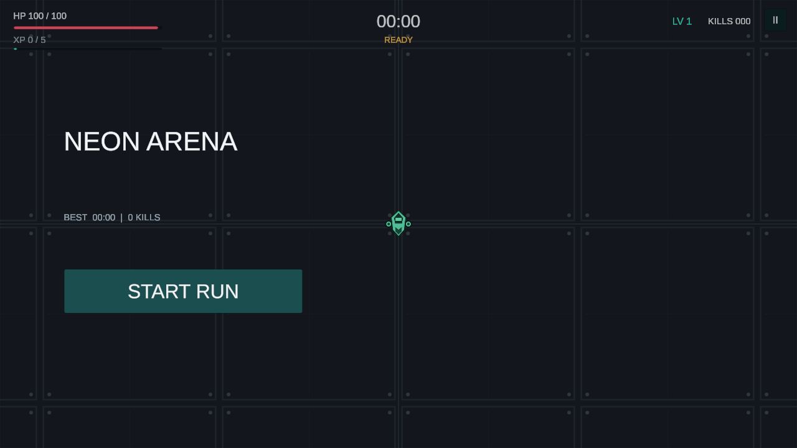
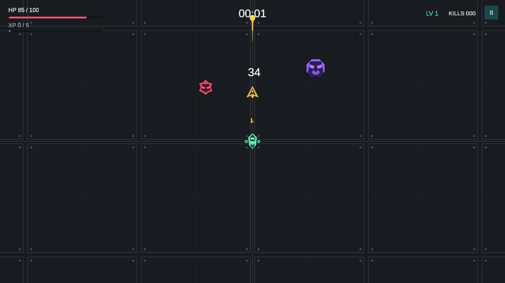
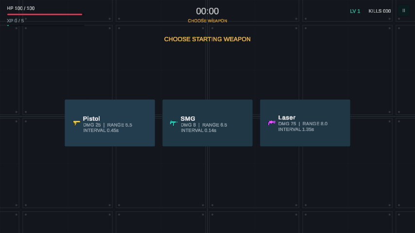

# v1.2.0 美术反馈版

1. Unity 停止 Play，等待导入，打开 `Assets/Scenes/Main.unity` 再运行。
2. 开始页现在铺在竞技场背景上；选武器仍在点击 START RUN 之后。
3. 玩家和三类敌人有不同精灵轮廓，武器槽/选项使用新的武器图标。
4. 射击观察子弹拖尾、枪口粒子和命中数字；死亡数字为暖色，普通命中为白色。
5. 按 Esc 检查暂停、恢复、重新开始；生命、升级和武器槽规则保持原有设计。

外观在运行时接入，编辑器未运行时仍可能显示旧的绿色方块。不必手动修改 Player 的 Inspector。
新增素材在 `Assets/Resources/Polish/`，生成工具在 `tools/generate_polish_art.py`。

发布附件在 `Builds/Packages/v1.2.0/`，源码提交不包含 Builds。
更新和复测记录见 `devlogs/17-v1.2.0-presentation-polish.md` 与 `test-results/v1.2.0/`。
v1.1.0 手机已测不代表此版手机已测；请安装新版确认触控、升级和暂停没有问题。
两款游戏统一的 GitHub 操作见工作区根目录 `docs/00_TWO_GAME_V1_2_0_HANDOFF.md`。
