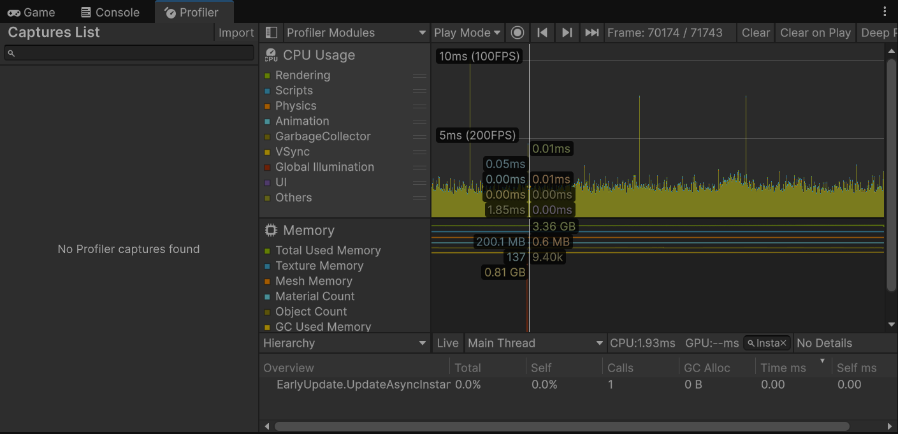
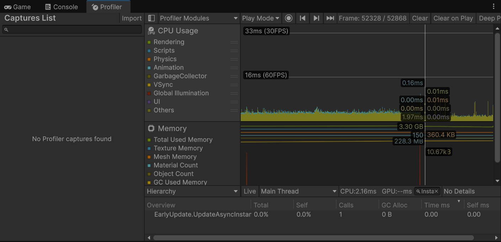

# Object Pooling Profiler Comparison

日期：2026-09-27  
设备：12th Gen Intel(R) Core(TM) i9-12900H，31.7 GB RAM  
系统：Windows 11 家庭中文版 10.0.26200  
Unity：6000.3.18f1  
分辨率：1920 × 1080  
方法：两个版本均按第 11 关流程预热 180 秒，随后采集 30 秒；关闭 Deep Profile。

## Comparison Scope

优化前使用提交 `e85a9f7`，该版本仍通过 `Instantiate/Destroy` 管理战斗对象。优化后使用提交 `ebc256a`，子弹、敌人、经验物和出生预警均通过 `GameObjectPool` 与 `PoolMember` 复用。

两个版本的玩法规模不同，因此本记录不使用两张截图中的单帧 CPU 数值计算“性能提升百分比”。对比重点是高频对象的生命周期管理方式，以及稳态采样中是否仍出现可见的同步创建和销毁热点。

## Captured Results

| 指标 | Before `e85a9f7` | After `ebc256a` |
|---|---:|---:|
| 截图选中帧 | 70174 / 71743 | 52328 / 52868 |
| 选中帧 CPU | 1.93 ms | 2.16 ms |
| Total Used Memory | 3.36 GB | 3.30 GB |
| `Instantiate` 筛选可见行 | `EarlyUpdate.UpdateAsyncInstantiate` | `EarlyUpdate.UpdateAsyncInstantiate` |
| 可见行 Calls | 1 | 1 |
| 可见行 GC Alloc | 0 B | 0 B |
| 可见行 Time | 0.00 ms | 0.00 ms |
| 整帧 GC Alloc | 未记录 | 未记录 |
| `Destroy` 调用次数 | 未记录 | 未记录 |

这里的 `0 B` 只属于筛选后显示的 Unity 内部行，不能解释为整帧零分配。两张截图都没有捕获到可归因于玩法脚本的同步 `Instantiate` 或 `Destroy` 行，因此不能仅凭这两张图量化对象池减少了多少次创建或多少 GC。

## Before

- Commit：`e85a9f7`
- 代表帧 CPU：`1.93 ms`
- Total Used Memory：`3.36 GB`
- 筛选结果：只显示 Unity 内部 `EarlyUpdate.UpdateAsyncInstantiate`，Calls=`1`、GC Alloc=`0 B`、Time=`0.00 ms`
- Console 红色 Error：截图未包含 Console 计数，本日志不据此填写数量

## After

- Commit：`ebc256a`
- 代表帧 CPU：`2.16 ms`
- Total Used Memory：`3.30 GB`
- 筛选结果：只显示 Unity 内部 `EarlyUpdate.UpdateAsyncInstantiate`，Calls=`1`、GC Alloc=`0 B`、Time=`0.00 ms`
- Console 红色 Error：截图未包含 Console 计数，本日志不据此填写数量

## Implementation Evidence

当前版本的高频对象使用统一的 Queue 对象池：

1. `GameObjectPool.Warm` 在启动时按 Initial Size 预先创建对象。
2. `Get` 从队列取出对象；队列耗尽时创建一个新实例，以保证游戏继续运行。
3. `Release` 关闭对象、恢复父节点并重新入队。
4. `PoolMember.isReleased` 防止命中、超时或出界在同一帧重复回收同一对象。
5. `Projectile` 在命中、超时或离开相机后回池。
6. `EnemyController` 在再次启用时恢复生命和接触状态。
7. `ExperiencePickup` 在再次启用时恢复可收集状态。
8. `EnemySpawnWarning` 在倒计时结束后生成敌人，再回收预警对象自身。

这部分代码能够证明当前实现采用了对象复用，但代码存在并不自动等于获得了某个确定的毫秒或 GC 百分比收益；量化结论仍以 Profiler 捕获结果为准。

## Conclusion

本轮完成了优化前后 Profiler 采样，并确认当前版本已经把高频战斗对象的生命周期改为预热、获取、状态重置和回收。两张代表帧的 CPU 分别为 `1.93 ms` 和 `2.16 ms`，但由于版本玩法规模不同且只记录了单帧，这组数据不能证明总 CPU 时间变快，也不能判定性能回退。

截图中的 `Instantiate` 过滤没有捕获到玩法脚本的同步创建热点，因此本轮可以陈述“当前稳态截图未观察到可见的同步创建热点”，不能陈述“Instantiate 降低了某个百分比”或“GC 已降为 0”。后续若需要量化创建次数，应保存完整 Profiler capture，或使用相同场景、相同对象数量的专用压力测试。

## Trade-offs

对象池增加常驻内存、启动预热时间和状态重置复杂度。池过小时仍会在峰值调用 `CreateInstance`，池过大则浪费内存。当前正式预热数量为：Projectile `32`、Enemy `24`、Experience `24`、SpawnWarning `32`，这些值需要继续根据目标平台上的峰值对象数量验证。

## Evidence Integrity

- 原始截图保存在 `docs/images/`，没有修改截图内容。
- 未显示的整帧 GC、Destroy 次数和 Console 数量均标记为“未记录”。
- 不用不同玩法规模的单帧数据计算性能提升比例。
- 简历和面试只陈述本日志能够支持的结论。
